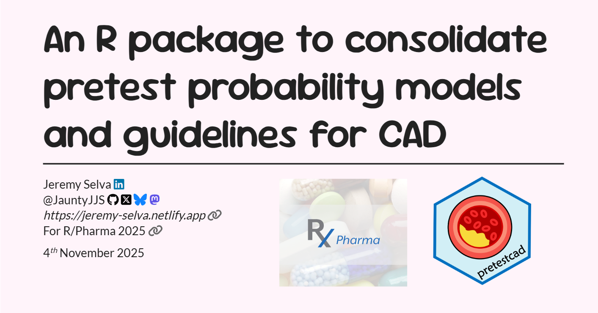

# R/Pharma 2025 Slides

## An R package to consolidate pretest probability models and guidelines for CAD

Here are the
<a href="https://github.com/JauntyJJS/RPharma2025_pretestcad"
target="_blank">source code</a> for my
<a href="https://jauntyjjs.github.io/RPharma2025_pretestcad/"
target="_blank">slides</a> presented at
<a href="https://rinpharma.com/" target="_blank">R/Pharma 2025
<code>r fontawesome::fa(name = "link", fill = "#666666")</code></a>.

